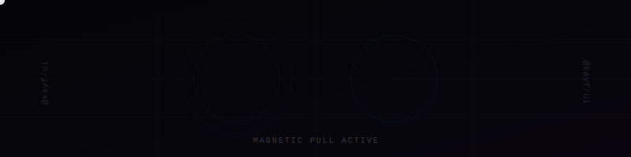

<div align="center">



<br/>

[](https://www.npmjs.com/package/@kayf/ui)
[](./LICENSE)
[](https://bundlephobia.com/package/@kayf/ui)
[](https://www.typescriptlang.org/)

</div>

---

## ✦ What is @kayf/ui?

`@kayf/ui` is a collection of **native Web Components** built around a dark, premium aesthetic — think game dashboards, dev tools, and next-gen SaaS interfaces. Every component ships with:

- **Zero framework dependencies** — works with React, Vue, Svelte, or vanilla HTML
- **Shadow DOM isolation** — no style leakage, ever
- **Glassmorphism 2.0** — dark surfaces, blur, glow, noise textures
- **TypeScript-first** — strict types, full IntelliSense support
- **Reactive attributes** — update via `setAttribute()` or HTML attributes

---

## ⚡ Quick Start

```bash
npm install @kayf/ui
```

```html
<!-- Option 1: Script tag (UMD) -->
<script src="node_modules/@kayf/ui/dist/kayf-ui.umd.js"></script>

<!-- Option 2: CDN -->
<script type="module" src="https://unpkg.com/@kayf/ui/dist/kayf-ui.esm.js"></script>
```

```ts
// Option 3: ES Module import
import '@kayf/ui'
```

---

## 🧩 Components

### `<kayf-spotlight-card>`



> A card that casts a radial spotlight following your cursor — revealing depth through light.

```html
<kayf-spotlight-card color="indigo" radius="300">
  <h3>Your content here</h3>
</kayf-spotlight-card>
```

| Attribute | Type | Default | Description |
|-----------|------|---------|-------------|
| `color` | `ColorVariant` | `indigo` | Spotlight tint |
| `radius` | `number` | `250` | Spotlight radius in px |

---

### `<kayf-beam-button>`

> A button with an animated light sweep on hover, plus ripple on click.

```html
<kayf-beam-button color="cyan" size="md">Launch Mission</kayf-beam-button>
```

| Attribute | Type | Default | Description |
|-----------|------|---------|-------------|
| `color` | `ColorVariant` | `indigo` | Beam color |
| `size` | `sm \| md \| lg` | `md` | Button size |
| `disabled` | `boolean` | `false` | Disables the button |

---

### `<kayf-aurora-card>`

> Canvas-animated aurora blobs drifting behind a glassmorphism surface.

```html
<kayf-aurora-card speed="0.5" blur="60" opacity="0.6">
  <p>Your content floats above the aurora.</p>
</kayf-aurora-card>
```

| Attribute | Type | Default | Description |
|-----------|------|---------|-------------|
| `speed` | `number` | `0.5` | Animation speed multiplier |
| `blur` | `number` | `60` | Blob blur radius (px) |
| `opacity` | `number` | `0.6` | Blob opacity 0–1 |

---

### `<kayf-glitch-text>`

> Text that randomly glitches — perfect for terminal UIs and game HUDs.

```html
<kayf-glitch-text intensity="0.5" interval="3000">SYSTEM ONLINE</kayf-glitch-text>
```

| Attribute | Type | Default | Description |
|-----------|------|---------|-------------|
| `intensity` | `number` | `0.5` | Glitch strength 0–1 |
| `interval` | `number` | `3000` | Time between glitches (ms) |
| `color` | `ColorVariant` | `cyan` | Accent color |

---

### `<kayf-hud-panel>`

> A scanline-overlay panel with HUD corner accents — straight out of a sci-fi cockpit.

```html
<kayf-hud-panel label="SYSTEM STATUS" color="cyan">
  <div>Your dashboard content here</div>
</kayf-hud-panel>
```

| Attribute | Type | Default | Description |
|-----------|------|---------|-------------|
| `label` | `string` | — | Panel header label |
| `color` | `ColorVariant` | `indigo` | Corner accent color |
| `scanlines` | `boolean` | `true` | Toggle scanline overlay |

---

### `<kayf-particle-field>` ✦ *new in 0.2.0*



> An interactive canvas particle system — particles connect with lines and repel from the cursor.

```html
<kayf-particle-field
  color="#6366f1"
  count="120"
  speed="0.4"
  connect-distance="100"
></kayf-particle-field>
```

| Attribute | Type | Default | Description |
|-----------|------|---------|-------------|
| `color` | `string` | `#6366f1` | Particle color (hex) |
| `count` | `number` | `100` | Number of particles |
| `speed` | `number` | `0.4` | Base movement speed |
| `connect-distance` | `number` | `100` | Max distance to draw lines (px) |

---

### `<kayf-counter>` ✦ *new in 0.2.0*



> Animated number counter that triggers on scroll into view with easeOutExpo easing.

```html
<kayf-counter
  value="98742"
  suffix="+"
  label="Active Users"
  color="#6366f1"
  icon="◎"
  duration="2000"
></kayf-counter>
```

| Attribute | Type | Default | Description |
|-----------|------|---------|-------------|
| `value` | `number` | `0` | Target number to count to |
| `label` | `string` | `Metric` | Label below the number |
| `suffix` | `string` | — | Appended text (e.g. `+`, `ms`, `%`) |
| `prefix` | `string` | — | Prepended text (e.g. `$`) |
| `decimals` | `number` | `0` | Decimal places |
| `color` | `string` | `#6366f1` | Accent color (hex) |
| `icon` | `string` | `◎` | Icon character above value |
| `duration` | `number` | `2000` | Animation duration (ms) |

---

### `<kayf-magnetic-btn>` ✦ *new in 0.2.0*



> A wrapper that makes any button magnetically attracted to the cursor. Physics-based lerp animation.

```html
<kayf-magnetic-btn strength="0.4">
  <button class="your-button">Get Started</button>
</kayf-magnetic-btn>
```

| Attribute | Type | Default | Description |
|-----------|------|---------|-------------|
| `strength` | `number` | `0.4` | Pull strength 0–1 |
| `radius` | `number` | `1.5` | Effect radius (× element size) |

---

## 🎨 Color Variants

All components that accept a `color` attribute support these built-in variants:

```ts
type ColorVariant =
  | 'indigo'   // #6366f1 — default
  | 'cyan'     // #06b6d4
  | 'pink'     // #f472b6
  | 'emerald'  // #10b981
  | 'amber'    // #f59e0b
  | 'red'      // #ef4444
```

Or pass any hex value directly: `color="#ff6b35"`

---

## 📦 Bundle Info

| Format | File | Size |
|--------|------|------|
| ESM | `dist/kayf-ui.esm.js` | ~18kb gzip |
| CJS | `dist/kayf-ui.cjs.js` | ~19kb gzip |
| UMD | `dist/kayf-ui.umd.js` | ~20kb gzip |
| Types | `dist/index.d.ts` | included |

---

## 🛠 TypeScript Usage

```ts
import { KayfParticleField, KayfCounter, KayfMagneticBtn } from '@kayf/ui'
import type { ColorVariant } from '@kayf/ui'

// Programmatic control
const field = document.querySelector<KayfParticleField>('kayf-particle-field')
field?.setAttribute('count', '200')
```

---

## 🧱 Framework Integration

<details>
<summary><strong>React</strong></summary>

```tsx
// Add to react-app-env.d.ts for JSX types
declare namespace JSX {
  interface IntrinsicElements {
    'kayf-particle-field': React.HTMLAttributes<HTMLElement> & { color?: string; count?: number }
    'kayf-counter': React.HTMLAttributes<HTMLElement> & { value?: number; label?: string }
    'kayf-magnetic-btn': React.HTMLAttributes<HTMLElement> & { strength?: number }
  }
}
```

```tsx
import '@kayf/ui'

export default function Hero() {
  return (
    <kayf-magnetic-btn strength={0.4}>
      <button className="btn-primary">Launch App</button>
    </kayf-magnetic-btn>
  )
}
```

</details>

<details>
<summary><strong>Vue 3</strong></summary>

```ts
// vite.config.ts
export default defineConfig({
  plugins: [vue({
    template: { compilerOptions: { isCustomElement: tag => tag.startsWith('kayf-') } }
  })]
})
```

```vue
<script setup>
import '@kayf/ui'
</script>

<template>
  <kayf-particle-field color="#6366f1" :count="120" />
</template>
```

</details>

<details>
<summary><strong>Vanilla HTML</strong></summary>

```html
<!DOCTYPE html>
<html>
<head>
  <script type="module" src="https://unpkg.com/@kayf/ui/dist/kayf-ui.esm.js"></script>
</head>
<body>
  <kayf-aurora-card>
    <h1>No framework needed.</h1>
  </kayf-aurora-card>
</body>
</html>
```

</details>

---

## 🗺 Roadmap

| Component | Status |
|-----------|--------|
| SpotlightCard | ✅ v0.1.0 |
| BeamButton | ✅ v0.1.0 |
| AuroraCard | ✅ v0.1.0 |
| GlitchText | ✅ v0.1.0 |
| HudPanel | ✅ v0.1.0 |
| ParticleField | ✅ v0.2.0 |
| CounterUp | ✅ v0.2.0 |
| MagneticButton | ✅ v0.2.0 |
| HolographicCard | 🔜 v0.3.0 |
| NeonBorder | 🔜 v0.3.0 |
| CommandPalette | 🔜 v0.3.0 |
| 3D TiltCard | 🔜 v0.3.0 |

---

## 📄 License

MIT © [@kayf](https://www.npmjs.com/~kayf)

---

<div align="center">

*Built in the dark. Shipped with precision.*

</div>
